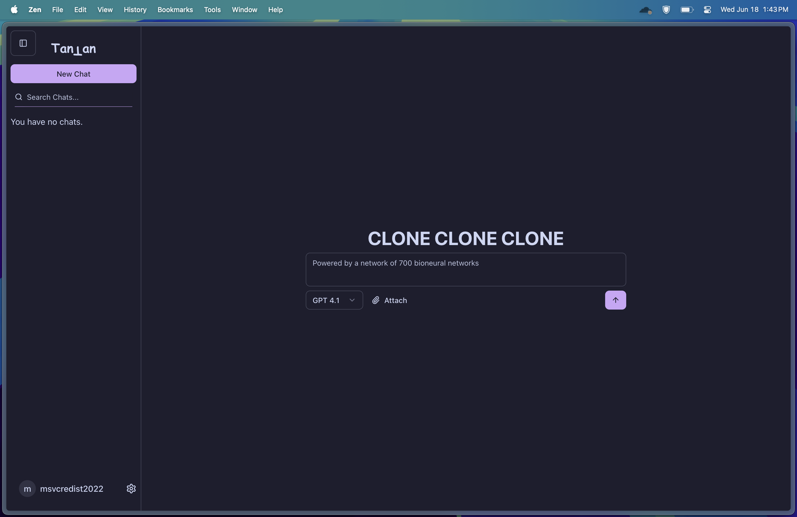

# TanTan Chat
Ergonomic Chat for Humans

TanTan Chat is a modern, ergonomic AI chat application designed to enhance user experience and productivity. It offers a clean and intuitive interface, ensuring that users can focus on their conversations without distractions.

We follow the weird OpenAI naming scheme, hence the name :p



*Note: No Humans used in the backend*<sup>\*</sup>


# Use
Visit a live instance here:
https://tantan.konkon.pablonara.com/

# Features
## File Uploads


## Real time chat sync


# Hosting & Setup
## Setup with Docker Compose
```sh
git clone https://github.com/t35-turbo/TanTanChat.git
cd TanTanChat
mv .env.example .env
# Optional: Set some secure random passwords!!!! as well as the port in .env
docker compose up --build -d
# Visit port 3111
```

## Higher Availability with Kubernetes
We use Kubernetes for our production website.
Clone this repository for CICD (GitHub Actions container builds) and check out the public GitOps repository for the Kubernetes manifests [here](https://github.com/t35-turbo/TanTanChat-GitOps-Public).

## Nix
Low-Priority WIP

# FAQ
<details>
<summary>Add Custom Models</summary>
Custom models can currently be added in the ModelSelector Client component. In the future we will add them to user settings (synced across clients).
</details>

<details>
<summary>Server-Stored Keys?</summary>
We will add server-stored Keys with the introduction of an admin panel.
</details>

<details>
<summary>Image Gen?</summary>
No
</details>

\*: *Backend may contain trace quantities of interns*
